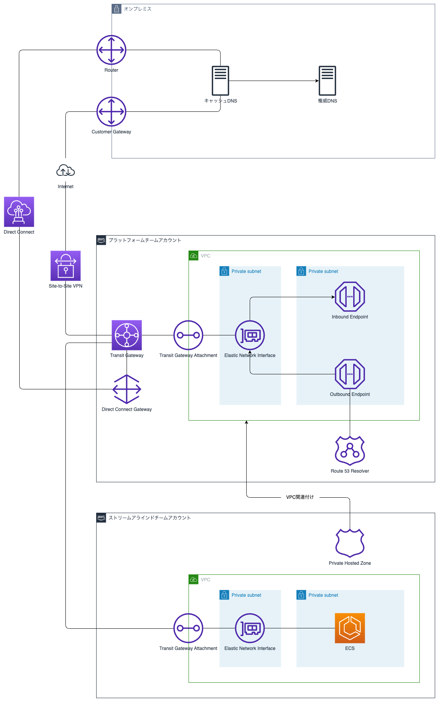

# aws-route53-terraform-example

## アーキテクチャ



## ディレクトリ構成

```
.
├── teams
│   ├── platform
│   │   └── env
│   │       ├── prod
│   │       └── test
│   │           ├── ap-northeast-1
│   │           └── ap-northeast-3
│   └── stream-aligned
│       └── env
│           ├── prod
│           └── test
│               ├── ap-northeast-1
│               ├── ap-northeast-3
│               └── global
└── modules
    ├── ram
    └── route53
        ├── hosted-zone
        │   ├── private-hosted-zone
        │   ├── public-hosted-zone
        │   ├── record
        │   │   ├── a-record
        │   │   └── ailias-record
        │   └── zone-association
        └── resolver
            ├── endpoint
            ├── rule
            └── rule-association
```
