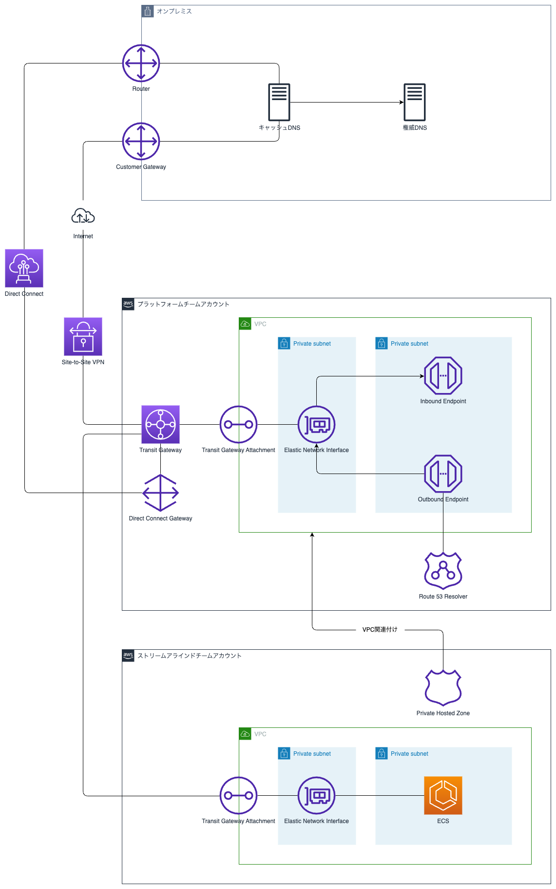

# aws-route53-terraform-example

オンプレミス環境と AWS 環境間の名前解決を実現する DNS 基盤の Terraform コードです。

## アーキテクチャ概要

**Team Topologies** に基づき、プラットフォームチームが DNS 基盤を集約管理し、各ストリームアラインドチームが共用する設計です。Resolver エンドポイントは ENI 単位で課金されるため、プラットフォームチームのアカウントに集約してコストを最適化します。



### オンプレミス → AWS の名前解決（インバウンド）

1. オンプレミスのキャッシュ DNS に、AWS 管理ドメイン（例: `*.aws.internal`）への条件付き転送を設定します。転送先は Route 53 Resolver **インバウンドエンドポイント**の IP アドレスです。
2. 各ストリームアラインドチームは、自チームの**プライベートホストゾーン（PHZ）** をインバウンドエンドポイントが配置された VPC に関連付けします。

### AWS → オンプレミスの名前解決（アウトバウンド）

1. プラットフォームチームが、オンプレミス DNS で管理されているドメイン（例: `*.corp.local`）に対する Route 53 Resolver **転送ルール**を作成します。転送先はオンプレミスの DNS サーバーです。
2. 作成した Resolver ルールを **AWS RAM** で各ストリームアラインドチームのアカウントに共有します。
3. 各ストリームアラインドチームは、共有された Resolver ルールを自チームの VPC に関連付けします。

## 各チームの作業分担

| チーム | 作業内容 |
|--------|----------|
| プラットフォームチーム | Resolver エンドポイントの構築・管理、転送ルールの作成、RAM によるルール共有 |
| ストリームアラインドチーム | PHZ の作成とインバウンドエンドポイント VPC への関連付け、共有された Resolver ルールの VPC 関連付け |
| オンプレ基盤チーム | キャッシュ DNS への条件付き転送設定 |

## ディレクトリ構成

```
.
├── teams
│   ├── platform
│   │   └── env
│   │       ├── prod
│   │       └── test
│   │           ├── ap-northeast-1
│   │           └── ap-northeast-3
│   └── stream-aligned
│       └── env
│           ├── prod
│           └── test
│               ├── ap-northeast-1
│               ├── ap-northeast-3
│               └── global
└── modules
    ├── ram
    └── route53
        ├── hosted-zone
        │   ├── private-hosted-zone
        │   ├── public-hosted-zone
        │   ├── record
        │   │   ├── a-record
        │   │   └── ailias-record
        │   └── zone-association
        └── resolver
            ├── endpoint
            ├── rule
            └── rule-association
```
